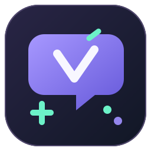

# ToolVH




Ứng dụng GUI trên Windows giúp quét text tiếng Anh trong thư mục game, dịch sang tiếng Việt, duyệt bản dịch và cài bản vá có sao lưu. Phiên bản hiện tại: **0.8.4**. Mã nguồn được cấp phép theo [Apache-2.0](LICENSE).

ToolVH hỗ trợ nhiều định dạng, nhưng **chưa thể Việt hóa mọi game**. Khả năng quét, cài bản dịch và sửa font phụ thuộc cấu trúc dữ liệu của từng game; cần kiểm tra kết quả trong game trước khi chia sẻ bản vá.

## Unity đóng gói (PEAK và cấu trúc tương tự)

- Đọc `*_Data/data.unity3d` UnityFS v7/v8 của Unity 2022+ không mã hóa, dùng block không nén/LZ4/LZ4HC. Đọc từng asset thay vì giải nén toàn bộ bundle lớn vào RAM; giới hạn MB áp dụng cho từng asset. Bật **Quét sâu bundle / PCK** rồi quét lại project cũ.
- Nhận diện bảng CSV English và JSON dạng vector có `CURRENT_LANGUAGE` xác nhận vị trí tiếng Anh; giữ nguyên khóa, nhãn ngôn ngữ và bản dịch ngôn ngữ khác.
- Khi xuất/cài, sao chép block gốc và chỉ thêm asset chứa text đã sửa; kiểm tra đọc lại. Bản vá có thể lớn hơn file gốc và cần đủ dung lượng cho bản vá, backup và file tạm.
- Text trong MonoBehaviour bị bỏ type tree, mã chương trình, bundle mã hóa hoặc font thiếu glyph vẫn cần adapter/sửa riêng. Quét được text không bảo đảm mọi màn hình đã được Việt hóa.

Xuất để chép hoạt động khi đã cài text/font bằng backup được kiểm tra; không thay đổi game thật. Bản dịch lỗi được giữ tiếng Anh và liệt kê trong gói. Gói text không kèm font. Font dynamic dùng font hoàn chỉnh, không ghép glyph thử nghiệm; Children of Morta có adapter font English dùng Fairfax gốc.

## Tính năng chính

- Quét dữ liệu, ưu tiên text tiếng Anh và đưa các mục chưa xác định rõ ngôn ngữ vào nhóm cần duyệt.
- Dịch bằng Gemini, Groq, OpenRouter free, API tương thích OpenAI, Ollama hoặc Google Dịch web thử nghiệm.
- Cung cấp ngữ cảnh game, văn phong và bảng thuật ngữ; bảo vệ tên riêng, biến và thẻ định dạng.
- Chỉnh sửa bản dịch, dịch lại các câu đã chọn, tự lưu theo lô và xuất/nhập CSV.
- Kiểm tra khả năng đọc/ghi và catalog trước khi dịch; xác minh SHA-256 trước khi tạo/cài bản vá.
- Sao lưu, cài và khôi phục bản dịch; chuyển sang game khác mà vẫn giữ bản vá và backup của game cũ.
- Kiểm tra ký tự còn thiếu, chuẩn hóa Unicode và sửa một số loại font với backup riêng.

## Phạm vi hỗ trợ

| Engine / dữ liệu | Phạm vi hiện tại |
|---|---|
| File text | JSON, CSV/TSV, XML, INI, TXT và phụ đề SRT theo cấu trúc bộ đọc hỗ trợ. |
| Unity | TextAsset, Localization StringTable có type tree và adapter `TranslatedMessageProvider` của Ori and the Will of the Wisps. Hỗ trợ cập nhật Addressables binary catalog v2 và JSON catalog cục bộ trong phạm vi writer hiện có. |
| Godot | PCK rời v1–v3 không mã hóa; CSV/JSON, gettext PO/MO UTF-8, trường text của TSCN, Translation TRES dạng text và Godot 4 Translation RSRC v5/v6 little-endian một resource. |
| Unreal Engine | LOCRES rời v0–v3; LOCRES không nén trong PAK v1–v7; PAK v10–v12 có full directory index với LOCRES không nén/Zlib/Gzip/Oodle. Không mã hóa/có chữ ký. Giữ namespace, key, hash nguồn và payload khác. |
| RPG Maker MV/MZ | JSON database trong `data/` khi nhận diện được core engine; tên, mô tả, thuật ngữ và lệnh sự kiện hiển thị thoại/lựa chọn. Không sửa script, plugin command hoặc trường note. |
| Ren’Py | Source/template RPY: thoại thường/nhiều dòng, thuộc tính nhân vật, `extend`, menu có điều kiện, say arguments và cặp old/new English. Monologue triple quote được tách từng khối, giữ điểm ngắt thoại. Không thực thi Python hoặc sửa logic game. |

**Các giới hạn đáng chú ý:**

- Unity thiếu type tree hoặc schema chưa nhận diện; Addressables remote/cache, catalog đóng trong bundle và cấu trúc dependency chưa hỗ trợ có thể bị chặn.
- Godot PCK mã hóa/sparse/v4 hoặc nhúng trong EXE; RSCC, OptimizedTranslation, scene binary và RSRC ngoài schema đã hỗ trợ. PO/MO chưa hỗ trợ đầy đủ plural; PO fuzzy/obsolete được bỏ qua. File nguồn có `.import`/`.remap` có thể bị bỏ qua vì game đọc tài nguyên đã nhập.
- Unreal PAK v8–v9, index không có tên file, codec Oodle không được decoder hỗ trợ, gói mã hóa/có chữ ký, IoStore (`.utoc`, `.ucas`) và text trong UASSET chưa hỗ trợ cài bản dịch. IoStore được đọc header để báo phiên bản/chunk và file cặp, không quét chuỗi nhị phân thành text giả.
- Bộ quét bỏ manifest và dữ liệu launcher/achievement trong thư mục `*-GSE`/`steam_settings`; không coi đó là text trong game. Bảng English `en-001` được nhận diện. Nếu PAK có tài nguyên Vietnamese sẵn, báo cáo gợi ý thử chọn Tiếng Việt trong game; chưa xác nhận chất lượng hoặc game có nạp bảng đó.
- Shady Job: đã đọc được 530 vị trí English trong hai bảng en/en-001 nén Oodle; kiểm tra ghi lại nguồn và tiếng Việt dài hơn vào PAK. Chưa xác nhận game nạp bản vá, font và toàn bộ text trong IoStore. Decoder oozextract MIT chạy trong WebAssembly có giới hạn bộ nhớ/fuel, được đóng gói sẵn; không tải/chạy DLL từ game.
- Sau quét, nếu không có câu được chọn, tool hiện **Tất cả** ứng viên và thông báo cần xem báo cáo, thay vì bảng trống ở bộ lọc **Đã chọn**. Không tự chọn các ứng viên chưa xác nhận là text game.
- Để build lại decoder từ nguồn: cài Rust, chạy `rustup target add wasm32-unknown-unknown`, rồi `powershell -ExecutionPolicy Bypass -File scripts/Build-Oodle.ps1`. WASM đã có trong repo, build EXE bình thường không cần Rust. Cargo.lock ghim phụ thuộc và thư mục native/oodle/THIRD-PARTY-LICENSES giữ thông báo bên thứ ba.
- Ren’Py RPA/RPYC, raw/backtick strings, speaker dạng biểu thức phức tạp, screen UI/Python, triple quote trong old/new và chế độ `rpy monologue none` chưa hỗ trợ. Các khối bị bỏ qua không được coi là đã dịch.

Tên engine được nhận diện không có nghĩa toàn bộ text trong game đã được tìm thấy. Các mục thiếu thông tin locale cần được xác nhận là tiếng Anh trước khi dịch.

BOMBANANA!, Ori and the Will of the Wisps và R.E.P.O. đã có kết quả sử dụng thực tế theo xác nhận của người dùng, trên các bản game đã thử. Các adapter Godot, Unreal, RPG Maker và Ren’Py được kiểm thử bằng dữ liệu tổng hợp; chưa xác nhận trên game thương mại tương ứng.

## Cài đặt và chạy

### Bản đóng gói Windows

Nếu có bản Windows tại [Releases](https://github.com/JunnDung/ToolVH/releases), tải ZIP, giải nén toàn bộ và mở `ToolVH/ToolVH.exe`. Giữ EXE cùng thư mục `_internal`; bản đóng gói không cần cài Python.

### Chạy từ mã nguồn

Môi trường kiểm thử: Windows 10/11 x64 và Python 3.12. Mở PowerShell tại thư mục mã nguồn rồi chạy:

```powershell
py -3.12 -m venv .venv
.\.venv\Scripts\python.exe -m pip install -r requirements.txt
.\.venv\Scripts\python.exe -m toolvh gui
```

Sau khi cài phụ thuộc, có thể mở bằng `Start-ToolVH.cmd`.

## Cách Việt hóa game

1. Chọn thư mục game và bấm **Quét dữ liệu**. Bật **Quét sâu bundle / PCK** nếu cần đọc dữ liệu đóng gói.
2. Duyệt câu nguồn, chọn các mục tiếng Anh cần dịch và lưu project ở thư mục làm việc riêng.
3. Trong **Cấu hình**, chọn dịch vụ, nhập URL/model/key phù hợp rồi **Kiểm tra kết nối**. Bổ sung ngữ cảnh, tên riêng và thuật ngữ của game.
4. Dùng **Kiểm tra khả năng cài** trong **Báo cáo / Cài đặt**, rồi **Dịch thử 10 câu** trước khi dịch nhiều. Kiểm tra khả năng cài cũng chạy tự động trước khi dịch.
5. Duyệt bản dịch, chạy **Kiểm tra bản dịch**, sửa các câu có lỗi và kiểm tra font nếu cần.
6. Lưu project, đóng game rồi bấm **Cài vào game**, hoặc **Xuất để chép…** để lưu bản vá riêng. Mở game kiểm tra font, bố cục và ngữ cảnh.

Nếu bản vá thay bảng tiếng Anh, giữ lựa chọn **English** trong game. Kiểm tra khả năng cài thử cả câu nguồn và câu tiếng Việt dài hơn, đồng thời báo các mục chưa chọn và file chưa trích xuất được text. Bước này không ghi vào game hoặc gọi API; kết quả đạt chỉ xác nhận các vị trí đã chọn có thể đọc/ghi bằng adapter, chưa bảo đảm game sẽ nạp bản vá hoặc hiển thị đúng.

Giữ project và thư mục bản vá chứa `backup/`. **Khôi phục** trả các file đã vá về bản gốc, vẫn giữ bản dịch trong project. Nếu đã cài bản vá font, khôi phục font từ bản mới nhất trước khi khôi phục bản dịch.

Để Việt hóa game khác, chọn thư mục mới rồi quét; không cần khôi phục game cũ. Khi quét lại chính game đang có bản dịch đã cài, cần khôi phục trước để không lấy tiếng Việt làm câu nguồn. Tool chặn cài khi dữ liệu game khác phiên bản lúc quét; bản dịch chỉ được ghép lại khi nguồn, ngữ cảnh và vị trí phù hợp, không tự ghép mục mơ hồ. CSV nhập phải khớp ID và câu nguồn.

## Xuất để chép trực tiếp vào game

Sau khi duyệt bản dịch, bấm **Xuất để chép…** và chọn nơi lưu ngoài thư mục game. Gói xuất gồm:

- `files/`: các file đã vá, giữ đúng đường dẫn tương đối trong game; gồm catalog cần cập nhật nếu có.
- `backup/`: bản gốc của các file được thay đổi.
- `manifest.json`: danh sách file và SHA-256 để ToolVH kiểm tra khi cài/khôi phục.
- `README.txt`: hướng dẫn chép và danh sách file cần thay thế.

Đóng game, mở `files/`, chép **toàn bộ nội dung bên trong** vào thư mục gốc game và đồng ý thay thế. Không chép chính thư mục `files/` vào game, không bỏ riêng catalog/bundle. Khi vá bảng tiếng Anh, chọn English trong game.

Giữ gói xuất bên ngoài game. Để khôi phục thủ công, đóng game và chép nội dung bên trong `backup/` về thư mục gốc; khôi phục bản vá font cài sau bản dịch trước. Có thể dùng chức năng cài/khôi phục bản vá trong **Báo cáo / Cài đặt** với cùng gói này.

Chép thủ công không kiểm tra phiên bản hoặc ghi nhận bản vá trong project. Chỉ dùng cho bản game đã quét; khôi phục trước khi quét lại. Gói text không tự kèm bản vá font riêng. Với chữ thiếu dấu hoặc ô vuông, dùng **Kiểm tra / sửa font** và kiểm tra kết quả trong game.

## Visual novel dùng Ren’Py

Chọn thư mục gốc game, quét các file `.rpy`, xác nhận nguồn English và chọn câu cần dịch. Nếu script không có thông tin locale, câu mặc định chưa được chọn; kiểm tra ngôn ngữ trước khi chọn hàng loạt.

Tool lấy lời thoại và lựa chọn, bổ sung label/người nói/thuộc tính vào ngữ cảnh. Tên người nói dạng chuỗi được giữ nguyên và được thêm vào danh sách bảo vệ khi xuất hiện trong thoại. Ngữ cảnh lân cận có thể đi qua người nói khác trong cùng label, không lấy thoại ở label khác. Với monologue triple quote mặc định, mỗi khối ngăn bằng dòng trống là một câu dịch riêng để giữ lượt thoại. Giữ nguyên `[player]`, `{b}`, `{w}` và các biến/thẻ của Ren’Py trong bản dịch.

Dùng **Xuất để chép…** rồi chép nội dung `files/` vào đúng thư mục game. Kiểm tra game nạp script, ngắt thoại, lựa chọn và font. Bộ kiểm thử hiện xác minh parser, đọc lại, xuất/cài/khôi phục trên script tổng hợp; chưa kiểm tra compile/load với Ren’Py runtime hoặc visual novel thương mại.

Game chỉ có `.rpa`/`.rpyc` cần adapter đóng gói/biên dịch khác; tool chưa tự giải mã hoặc ghi lại các định dạng này. KiriKiri/KAG, NScripter và engine visual novel khác cũng chưa có adapter riêng. Xem [tài liệu thoại Ren’Py](https://www.renpy.org/doc/html/dialogue.html) và [quy tắc chuỗi](https://www.renpy.org/doc/html/language_basics.html) cho cú pháp.

## Dịch vụ dịch

| Dịch vụ | Cấu hình |
|---|---|
| Google AI Studio / Gemini | Tạo key tại [AI Studio](https://aistudio.google.com/api-keys), tải danh sách model, chọn model rồi kiểm tra kết nối. |
| Groq | Key tại [Groq Console](https://console.groq.com/keys); dùng endpoint preset của tool. |
| OpenRouter free | Key tại [OpenRouter](https://openrouter.ai/settings/keys); preset chỉ chấp nhận model `:free` hoặc `openrouter/free`. |
| API tương thích OpenAI | Nhập base URL, model và key theo nhà cung cấp. |
| API Responses | Nhập base URL/model/key; nhận diện URL kết thúc `/responses`, đọc `output` hoàn tất và dùng `text.format` khi bật JSON mode. Không tự chuyển dịch vụ. |
| Ollama local | Cài Ollama, tải model và chạy dịch vụ; URL mặc định `http://localhost:11434`, không cần key cho dịch vụ local. |
| Google Dịch web | Không cần key/model; tính năng thử nghiệm, endpoint có thể bị giới hạn hoặc thay đổi. |

Hạn mức và chi phí phụ thuộc nhà cung cấp và tài khoản; tool không bảo đảm API miễn phí hoặc tự bật billing. Ollama chạy trên máy không cần mua API, nhưng tốc độ và chất lượng phụ thuộc model, RAM và GPU.

API nhận text được chọn để dịch. Key được giữ trong phiên hoặc mã hóa bằng Windows DPAPI nếu chọn lưu. Không đưa key, cấu hình cá nhân, project hay dữ liệu trích xuất từ game vào Git.

Từ màn hình **Bắt đầu**, bấm **Chọn Google Dịch miễn phí**, kiểm tra kết nối rồi dịch thử. Nút chỉ chọn dịch vụ, chưa gửi text hoặc tự chuyển sang API trả phí. Ollama là lựa chọn chạy local khi không muốn phụ thuộc dịch vụ web.

Google Dịch web lưu cache từng đoạn trong project để giảm yêu cầu cho nội dung lặp lại; tự chia đoạn dài tại ranh giới câu/từ, giữ biến/thẻ và khoảng trắng. Chờ giữa các yêu cầu thực tế, không chờ thêm giữa lô. **Dịch lại các câu đã chọn** bỏ qua cache; **Xóa cache Google Dịch** xóa cache mà không xóa bản dịch (lưu project sau khi xóa). Cache không dùng chung giữa các game và không thay thế việc duyệt chất lượng.

Google Dịch web áp dụng bảo vệ tên và glossary cục bộ, nhưng không dùng ngữ cảnh/văn phong project như model AI. Với mọi dịch vụ, cần duyệt bản dịch trước khi cài.

## API Responses và tốc độ

Chọn **API Responses (tương thích OpenAI)** trong Cấu hình, nhập URL/model/key, tải model nếu endpoint hỗ trợ và bấm **Kiểm tra kết nối**. URL có thể là base URL `/v1` hoặc URL đầy đủ kết thúc `/responses`. Trong preset API tương thích OpenAI, dán URL đầy đủ `/responses` cũng tự chọn giao thức Responses. Tool gửi `instructions`, `input`, `store: false` và đọc text trong `output` theo [OpenAI Docs](https://developers.openai.com/api/docs/guides/migrate-to-responses). Không lấy API key từ tài khoản ChatGPT hoặc tự đăng nhập; chi phí/quota theo nhà cung cấp.

Bấm **Tối ưu tốc độ** để đặt số câu mỗi lô và thời gian nghỉ phù hợp preset: API cloud thông thường 40 câu/0 giây, Groq/OpenRouter free 10 câu/2 giây, Ollama tối đa 5 câu/0 giây, Google Dịch 1 câu/2 giây với cache. Đây là cấu hình giảm số lượt gọi/chờ, không cam kết nhanh hơn mọi model; nếu bị cắt kết quả hoặc 429, giảm số câu hoặc tăng thời gian nghỉ. Giới hạn độ dài lô, ngữ cảnh, glossary, tên riêng và kiểm tra biến/thẻ vẫn được giữ. Nút chỉ thay cấu hình, chưa gửi request.

## Ngữ cảnh và tên riêng

Trong **Cấu hình**, giữ bật **Giữ nguyên tên nhân vật, địa danh, vật phẩm và kỹ năng**, mô tả game trong **Ngữ cảnh game**, thêm tên còn thiếu ở **Giữ thêm tên** (mỗi dòng một tên). Dùng **Xem tên nhận diện** để kiểm tra danh sách được bảo vệ; tool không tự nhận diện đầy đủ mọi tên riêng.

**Thuật ngữ** dùng dạng `nguồn = đích` và có ưu tiên cao hơn việc giữ tên. Chỉ đặt bản dịch cho tên riêng khi chủ động muốn Việt hóa tên đó. Các bản dịch cũ không tự thay đổi khi sửa cấu hình; chọn câu cần sửa rồi dùng **Dịch lại các câu đã chọn**. Tool sao lưu project trước khi dịch lại và giữ câu cũ nếu dịch thất bại.

Kiểm tra bản dịch phát hiện lỗi tên, biến và định dạng; không thay thế việc đánh giá nghĩa, giọng thoại hoặc bố cục trong game.

Khi mở project, tool kiểm tra lại bản dịch cũ theo quy tắc hiện tại. Trước xuất/cài, tên đứng riêng được khôi phục theo danh sách giữ tên/glossary; các câu còn vi phạm được đánh dấu đầy đủ và chặn cài, không chỉ báo lỗi đầu tiên.

**Thử lại câu lỗi** trong Cấu hình chỉ dịch mục đang chọn có lỗi, kể cả mục có bản dịch cũ; tạo bản sao project và giữ câu cũ nếu thất bại. Ollama tự thử riêng câu/lô sai. Nếu vẫn mất token, tool có thể dịch tối đa 64 đoạn chữ (16.000 ký tự), chia lô tối đa 5 đoạn/1.500 ký tự và ghép nguyên token/tên tại vị trí gốc cục bộ. Phục hồi này giữ định dạng nhưng cần duyệt nghĩa và độ tự nhiên của câu ghép. Không bỏ kiểm tra, không đổi dịch vụ; lỗi mạng dừng tác vụ. API cloud không tự gọi lại theo cơ chế này để tránh phát sinh thêm chi phí.

## Kiểm tra và sửa font

Mở **Báo cáo / Cài đặt → Kiểm tra / sửa font… → Quét font**. Chọn font hỗ trợ sửa, chọn TTF/OTF đủ ký tự hoặc để trống để lấy font Windows, rồi **Xuất bản vá font…** hoặc **Tạo và cài font**. Đóng game trước khi cài; giữ backup font riêng. Có thể dùng **Chuẩn hóa Unicode**, quét font lại và cài lại bản dịch khi cần.

Phạm vi sửa hiện tại gồm TTF/OTF rời, Unity dynamic Font có dữ liệu font nhúng, font bitmap Ori đã nhận diện và TMP static SDF một atlas có type tree phù hợp. TMP dynamic/multi-atlas/MSDF, atlas tham chiếu ngoài file và font trong PCK/PAK/IoStore chưa có phương án sửa chung. Font nguồn thiếu glyph, atlas thiếu chỗ hoặc schema không hỗ trợ sẽ bị chặn.

Không bảo đảm sửa mọi lỗi font: encoding, layout, shader và fallback cần chẩn đoán riêng. Kiểm tra giấy phép font trước khi chia sẻ bản vá; không đưa font Windows hoặc asset game vào mã nguồn.

## Phát triển

Chạy kiểm thử từ môi trường đã cài phụ thuộc:

```powershell
.\.venv\Scripts\python.exe -m unittest discover -s tests
.\.venv\Scripts\python.exe -m scripts.gui_smoke
.\.venv\Scripts\python.exe -m scripts.gui_api_smoke
.\.venv\Scripts\python.exe -m scripts.gui_switch_game_smoke
.\.venv\Scripts\python.exe -m scripts.gui_terminology_smoke
.\.venv\Scripts\python.exe -m scripts.gui_fonts_smoke
.\.venv\Scripts\python.exe -m scripts.gui_preflight_smoke
.\.venv\Scripts\python.exe -m scripts.gui_google_cache_smoke
.\.venv\Scripts\python.exe -m scripts.gui_responses_smoke
.\.venv\Scripts\python.exe -m scripts.gui_recovery_smoke
```

Kiểm thử dùng dữ liệu tổng hợp và mock API; không cần game thương mại hoặc API key. Kiểm thử GUI chạy offscreen; kiểm thử DPAPI cần môi trường Windows.

Build bản Windows sau khi tạo `.venv`:

```powershell
.\.venv\Scripts\python.exe -m pip install -r requirements-build.txt
.\Build.ps1
```

Script đọc phiên bản từ `toolvh/__init__.py`, tạo thư mục chạy tại `dist/<phiên bản>/ToolVH`, ZIP và file SHA-256. Giữ toàn bộ thư mục chạy cùng `_internal`. Dùng `-NoArchive` nếu chỉ cần thư mục chạy. Không commit `.venv`, `build` hoặc `dist`.

Xem [CHANGELOG](CHANGELOG.md) để biết thay đổi, [ROADMAP](ROADMAP.md) cho lộ trình, [CONTRIBUTING](CONTRIBUTING.md) để đóng góp và [THIRD_PARTY](THIRD_PARTY.md) cho thông tin phụ thuộc. Không đưa asset, text trích xuất hoặc bản vá game thương mại vào repo.


### Giao diện và xử lý lỗi

Bắt đầu ở tab **Bắt đầu**: chọn thư mục chứa file chạy game, quét dữ liệu, chọn dịch vụ dịch và dịch thử 10 câu. Nút dịch/xuất chỉ bật khi có dữ liệu phù hợp. Nếu bảng trống do bộ lọc, bấm **Hiện tất cả câu**. **Xuất để chép** tạo bản vá bên ngoài game; **Cài vào game** thay file game và lưu backup.

Khi tác vụ đang chạy, bấm **Dừng tác vụ** rồi chờ thao tác hiện tại kết thúc trước khi đóng ứng dụng. Tải model local có thể mất vài phút. Lỗi thông thường không đóng ứng dụng; xem **Kiểm tra / Khôi phục → Mở nhật ký lỗi** để lấy `errors.log` hoặc `native-crash.log`. Nhật ký giúp điều tra crash còn lại, không đảm bảo khắc phục mọi lỗi driver, thư viện native hoặc thiếu bộ nhớ.


Logo gốc của dự án nằm ở `toolvh/assets/toolvh.svg` (vector), `toolvh/assets/toolvh.png` và `packaging/ToolVH.ico`. Các tài nguyên này được phát hành cùng giấy phép Apache-2.0 của dự án.
